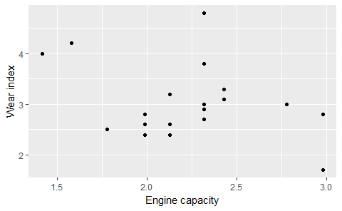
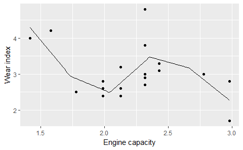
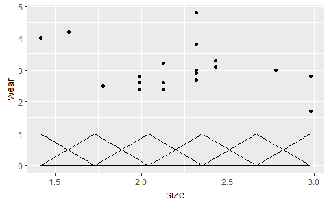
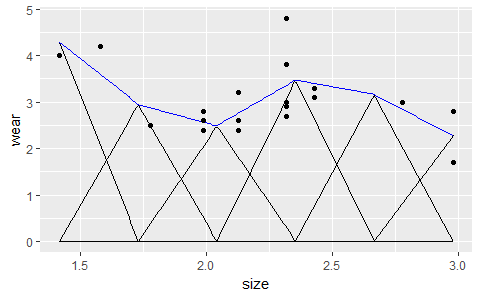
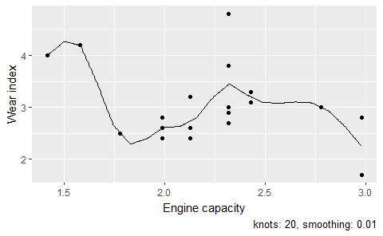
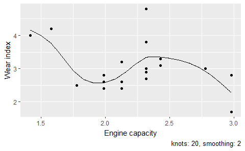
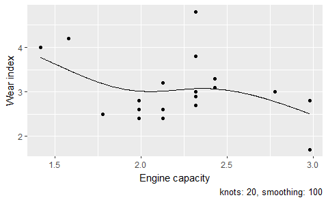

This notebook follows chapter four of Wood (2016).

GAMs add smoothing functions to GLMs.

$$
\begin{align}
	g(\mu_i) =\ &\mathbf{A}_i\boldsymbol{\theta}\ + &\mathrm{[GLM\ part]}\\
	& f_1(x_{1i}) + f_2(x_{2i}) +\ ... &\mathrm{[Smooths\ part]}
\end{align}
\\
$$

To add the smoothing functions we need a way to specify the smoothing functions
and a way to specify the smoothness of the functions.

## Univariate smoothing with tenting functions

To add smoothing functions to GLMs, we need a way to specify *f* so that we
still have a linear model. We do this by choosing a *basis*, a space of
functions containing *f*. For example, if the function is a cubic polynomial,
 $f(x) = \beta_1 + \beta_2x + \beta_3x^2 + \beta_4x^3$, the basis would
be $b_1(x) = 1$ $b_2(x) = x$, etc.

Polynomials are bad for interpolation because they have to have continuous
derivatives so they can oscillate greatly from point to point.

Next part talks about a piecewise linear basis or a tent function. (They look
like pointy splines to me.)


```r
library(gamair)
#> Warning: package 'gamair' was built under R version 3.4.3
library(ggplot2)

# Data from 19 Volvo engines
data(engine)

ggplot(engine) + 
  aes(x = size, y = wear) + 
  geom_point() +
  labs(x = "Engine capacity", y = "Wear index")
```

<!-- -->

Write a function defining a tenting function basis $b_j(x)$:


```r
# Get nth tent function from set of n knots
tent_at <- function(x, knots, knot_num) {
  # Defaults to zero
  dj <- knots * 0
  dj[knot_num] <- 1
  approx(knots, dj, x)[["y"]]
}


# Create a tenting function model matrix of x values with xj knots
tent <- function(x, knots) {
  n_knots <- length(knots)
  n_points <- length(x)
  model_matrix <- matrix(NA, n_points, n_knots)
  for (knot_i in seq_len(n_knots)) {
    model_matrix[, knot_i] <- tent_at(x, knots, knot_i)
  }
  model_matrix
}
```

Try six evenly spaced knots over the range of the data.


```r
six_knots <- modelr::seq_range(engine$size, n = 6)
tent_basis <- tent(engine$size, six_knots)
round(tent_basis, 2)
#>       [,1] [,2] [,3] [,4] [,5] [,6]
#>  [1,] 0.00 0.00 0.00 0.00 0.64 0.36
#>  [2,] 0.00 0.00 0.00 0.76 0.24 0.00
#>  [3,] 0.00 0.00 0.12 0.88 0.00 0.00
#>  [4,] 0.00 0.00 0.00 0.76 0.24 0.00
#>  [5,] 0.00 0.00 0.00 0.00 0.00 1.00
#>  [6,] 0.00 0.00 0.12 0.88 0.00 0.00
#>  [7,] 0.00 0.00 0.12 0.88 0.00 0.00
#>  [8,] 0.00 0.00 0.12 0.88 0.00 0.00
#>  [9,] 0.00 0.00 0.12 0.88 0.00 0.00
#> [10,] 0.00 0.00 0.72 0.28 0.00 0.00
#> [11,] 0.00 0.00 0.72 0.28 0.00 0.00
#> [12,] 0.00 0.00 0.72 0.28 0.00 0.00
#> [13,] 0.00 0.00 0.00 0.00 0.00 1.00
#> [14,] 0.00 0.17 0.83 0.00 0.00 0.00
#> [15,] 0.00 0.17 0.83 0.00 0.00 0.00
#> [16,] 0.00 0.17 0.83 0.00 0.00 0.00
#> [17,] 0.00 0.85 0.15 0.00 0.00 0.00
#> [18,] 0.49 0.51 0.00 0.00 0.00 0.00
#> [19,] 1.00 0.00 0.00 0.00 0.00 0.00
```

Fit a model.


```r
m <- lm(wear ~ tent_basis - 1, engine)
```

Get the predicted values at 200 points in the x range.


```r
pred_range <- modelr::seq_range(engine$size, n = 200)
pred_matrix <- tent(pred_range, six_knots)

# Multiply the six matrix columns by model coefficients
predicted <- data.frame(size = pred_range, wear = pred_matrix %*% coef(m))
```


```r
ggplot(engine) + 
  aes(x = size, y = wear) + 
  geom_point() +
  labs(x = "Engine capacity", y = "Wear index") + 
  geom_line(data = predicted)
```

<!-- -->

I can use my aweomse polypoly package to help visualize the basis. Here are the
tenting functions at the six knots.


```r
library(dplyr, warn.conflicts = FALSE)

unweighted <- polypoly::poly_melt(pred_matrix) %>% 
  left_join(data.frame(observation = 1:200, size = pred_range)) %>% 
  rename(wear = value)
#> Joining, by = "observation"

ggplot(unweighted) + 
  aes(x = size, y = wear) + 
  geom_line(aes(group = degree)) + 
  stat_summary(fun.y = sum, geom = "line", color = "blue") + 
  geom_point(data = engine)
```

<!-- -->

Here are the model weights applied to each tenting function and how they sum to
the fitted values.


```r
weighted <- polypoly::poly_melt(pred_matrix %*% diag(coef(m))) %>% 
  left_join(data.frame(observation = 1:200, size = pred_range)) %>% 
  rename(wear = value)
#> Joining, by = "observation"

ggplot(weighted) + 
  aes(x = size, y = wear) + 
  geom_line(aes(group = degree)) + 
  stat_summary(fun.y = sum, geom = "line", color = "blue") + 
  geom_point(data = engine)
```

<!-- -->

### Penalize the wiggliness

We add a wiggliness penalty to the least-squares objective to automatically get
the right amount of smoothness. A long derivation shows that wiggliness penalty
can incorporated into the model matrix by augmenting the _y_ and _X_ matrices.


```r
fit_penalized_tent <- function(y, x, knots, smoothing) {
  x_mat <- tent(x, knots)
  diffs <- diff(diag(length(knots)), differences = 2)
  # augment the x matrix with smoothing penalties 
  x_mat <- rbind(x_mat, sqrt(smoothing) * diffs)
  y <- c(y, rep(0, nrow(diffs)))
  lm(y ~ x_mat - 1)
}
```

For the sake of illustration, these are the dummy X values that are weighted by
the penalty term.


```r
diff(diag(length(six_knots)), differences = 2)
#>      [,1] [,2] [,3] [,4] [,5] [,6]
#> [1,]    1   -2    1    0    0    0
#> [2,]    0    1   -2    1    0    0
#> [3,]    0    0    1   -2    1    0
#> [4,]    0    0    0    1   -2    1
```


We can have lots of knots, and the smoothing penalty will be the main degree of
freedom for fitting the basis. More penalty, more like a straight line. Less
penalty, more wiggle.


```r
plot_engine_tent_model <- function(smoothing, knots) {
  knot_breaks <- modelr::seq_range(engine$size, knots)
  m <- fit_penalized_tent(engine$wear, engine$size, knot_breaks, smoothing)
  
  pred_range <- modelr::seq_range(engine$size, 500)
  pred_matrix <- tent(pred_range, knot_breaks)
  predicted <- data.frame(size = pred_range, wear = pred_matrix %*% coef(m))
  
  ggplot(engine) + 
    aes(x = size, y = wear) + 
    geom_point() +
    labs(x = "Engine capacity", y = "Wear index") + 
    geom_line(data = predicted) + 
    labs(caption = sprintf("knots: %s, smoothing: %s", knots, smoothing))
}

plot_engine_tent_model(.01, 20)
```

<!-- -->

```r
plot_engine_tent_model(2, 20)
```

<!-- -->

```r
plot_engine_tent_model(100, 20)
```

<!-- -->
